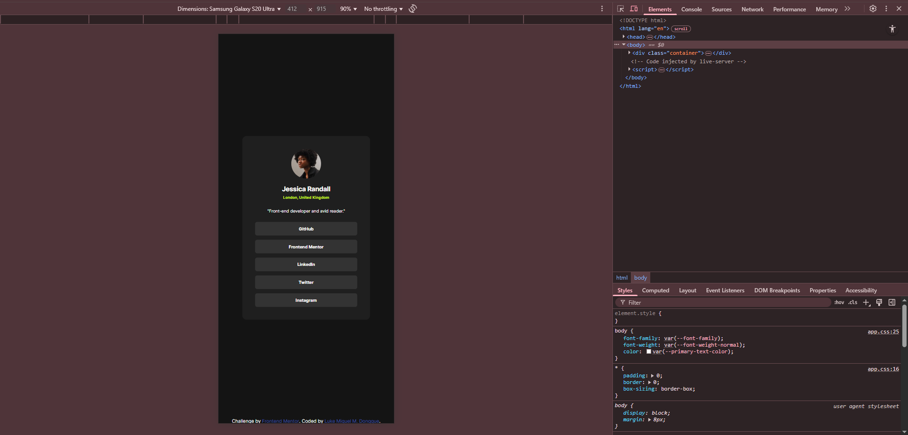

# Frontend Mentor - Social links profile solution

This is a solution to the [Social links profile challenge on Frontend Mentor](https://www.frontendmentor.io/challenges/social-links-profile-UG32l9m6dQ). Frontend Mentor challenges help you improve your coding skills by building realistic projects. 

## Table of contents

- [Overview](#overview)
  - [The challenge](#the-challenge)
  - [Screenshot](#screenshot)
  - [Links](#links)
- [My process](#my-process)
  - [Built with](#built-with)
  - [What I learned](#what-i-learned)
  - [Continued development](#continued-development)
- [Author](#author)

## Overview

### The challenge

Users should be able to:

- See hover and focus states for all interactive elements on the page

### Screenshot

### Links

- Solution URL: [Add solution URL here](https://your-solution-url.com)
- Live Site URL: [Add live site URL here](https://your-live-site-url.com)

## My process

### Built with

- Semantic HTML5 markup
- CSS custom properties
- Flexbox

### What I learned

In this project, I got to apply my understanding in HTML and CSS. I learned that in building projects especially a website, I need to understand first how the HTML of the project should be written because it is the foundation of your website and without it, websites won't work as you intended it to be. I also learned that in styling your HTML, organization of styles is important in order for you to keep track of the styles you used.

### Continued development

I want to improve my organization skills in writing my HTML and CSS.

## Author

- Frontend Mentor - [@lukedongque](https://www.frontendmentor.io/profile/lukedongque)
- GitHub - [@lukedongque](https://github.com/lukedongque)

